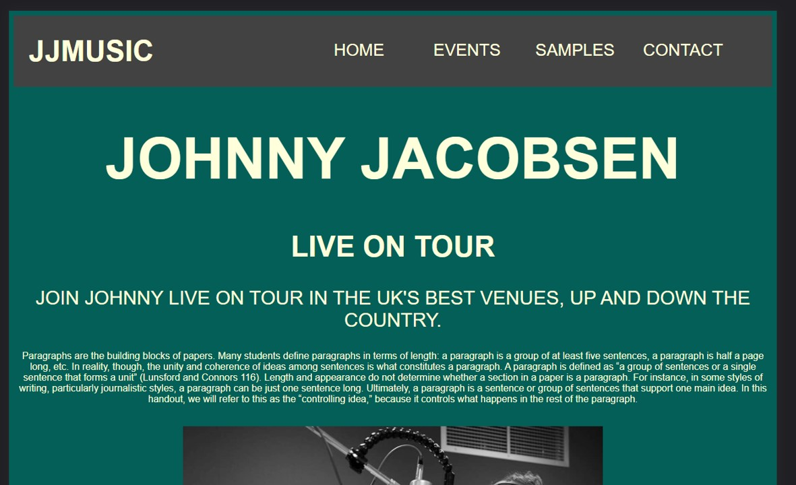
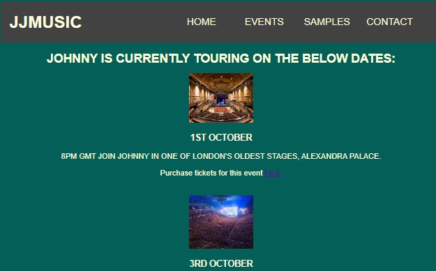
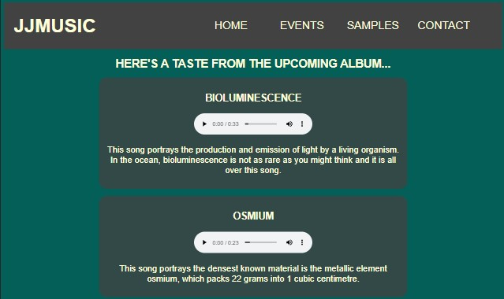
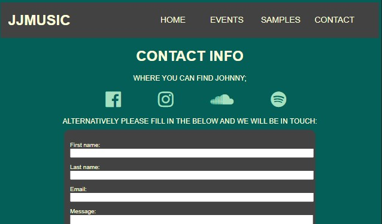

JJMUSIC

Gallery (a.k.a JJmusic) is a website designed to showcase the music of artist Johnathon Jacobsen. the intention is to provide information venues so that they can book the artist for future gigs. whilst also being a hub of information for fans to be able to find out upcoming events that the artist will be performing at.

The site is designed in a minimalistic way to not detract from the artists music. 

FEATURES

    Navigation Bar
        The navigtion bar is displayed as a constant across all fou pages of the site.
        
        It shows the site logo in the top left and has easy use, responsive  navigational buttons on the right.
        
        This implimentation of this will help to keep continuity between all of the pages whilst allowing the user to navigate quickly and easily between them.

    Home Page 
    

        This section is a breif overview of the artist and shows the user immediately what the website is about.
        
        The punchy headings will grab the attention of the user and draw them in to find out more.

        The home page also houses an image of the artist himself.

    Events Page

        This page is entirely informational and will allow the user to see when the artist is next performing.

        Active hyperlinks are included on this page to direct users to purchase tickets for the upcoming events.

        The code for this page was written with the intention of making it easy to display when a specific event is sold out. future implimentions will use an API to make this process integrated and autiomated.

    Samples Page

        This page shows dislays a small portion of the artists catalogue. (currently the audio files are for demonstartional purposes only)
        
        The page layout is designed to be simple as to not distract from the music and allow the user to focus immersively on the real art.

        The user has full control of the music, they are able to play, pause, scrub along the timeline, and adjust the volume. all from within the website.
        
    Contact Page

        The Contact page is designed to direct the user to all of the artists social network accounts. It does this by providing hyperlinks embedded in the well known icons of each of the most popular social sites.

        This page also provides the user with ability to send an email to the artists management team to book him for events and enquire about any other professional opportunities. (the form is set up on the website however the backend is not fully functional and therefor no data is currently captured when the user submits).

The site is designed to fit screen sizes 1280px wide (PC), and 768px wide (tablet ipad) and ide. Further work will need to be done to increase supported screen sizes. To test the usability of the site at each size I used the F12 key to enter the console and from there I could check the different screen resolutions. After testing I made adjustments to the CSS file to correct any issues and re-tested using the same method.

For the smaller screen size I have made a conscious effort to make any buttons spaced far enough apart to, make it useable with touchscreens.

Features left to implement
    Music videos could be supported on the samples page when the artist produces them.
    
    I would like to implement some subtle animations using Javascript to elevate the site and make transitions more seemless.

Testing 

 - The social media icons need to be adjusted to be smaller screen size, the CSS code for this is not working in the stylesheet. this will be fixed in the next update.

 - I ran into some issue when pushing to github. I had put all of the html files in a folder named "main" and the landing age was called "home.html" this meant that Github was only finding the Readme.md file and not my home page. to rectify this I took the html files out of the folder and renamed the landing page to index.html - this solved the issue after the updates were pushed to Github.

all pages have been validated using the below sites;

HTML - No errors were returned when passing through the official W3C validator
CSS - No errors were found when passing through the official (Jigsaw) validator

Unfixed Bugs

Credits
The media content was sourced as follows;

    main/images/home/Pic1.jpg - was sourced from facebook https://www.facebook.com/photo/?fbid=2983591945016982&set=a.138239379552267 permission to use this was recieved by the owner of tha content.

    main/images/events/ally-pally.jpg - was sourced from https://thespaces.com/see-inside-londons-freshly-restored-alexandra-palace-theatre/ -  I do not own this content, copyright is not intended.

     
    main/images/events/o2-arena.jpg - was sourced from https://www.iq-mag.net/2019/07/ticketmaster-signs-o2-arena-prague/ -  I do not own this content, copyright is not intended.

    main/images/events/rock-city.jpg was sourced from https://www.bbc.co.uk/news/uk-england-nottinghamshire-46244014 -  I do not own this content, copyright is not intended.

    song1 song2 song3 - these audio files were receieved from the artist himself.

    all icons were sourced from Font awesome, these are copyright free.

Content 

    The stand in paragraphs on the home page were sourced from https://en.wikipedia.org/wiki/Paragraph - no copyright is intended, these are being used while i wait for the artoist to provide a biography.
    
    The information for each sample is from a google search of each of the titles. This was used as the music is currently unnamed, descriptions will be added before the site is live. I am awaiting details from the artist.

